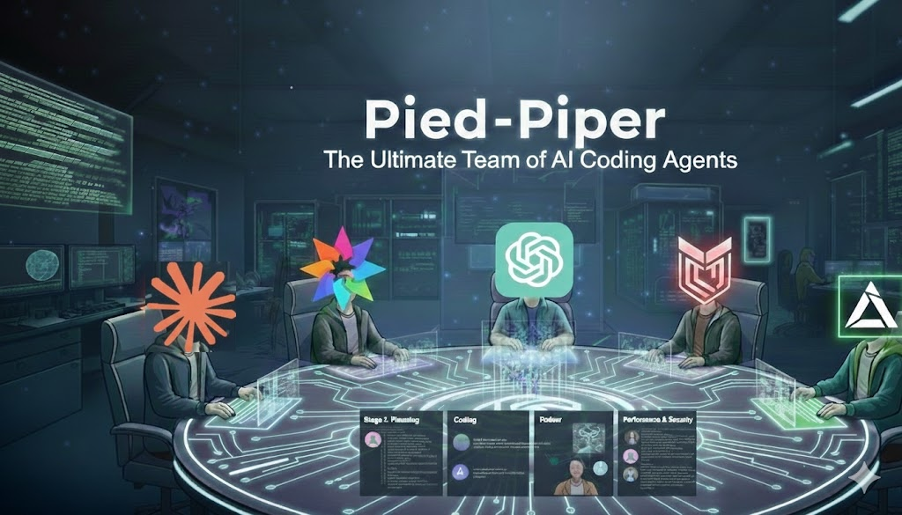
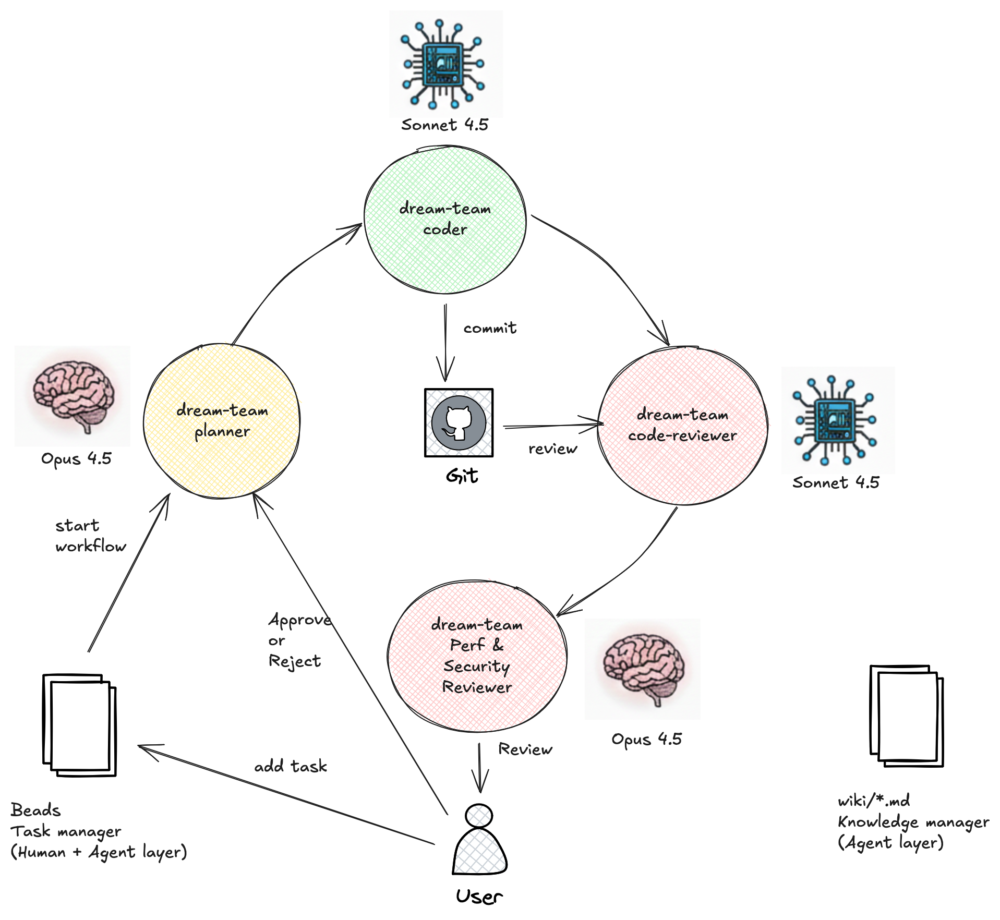
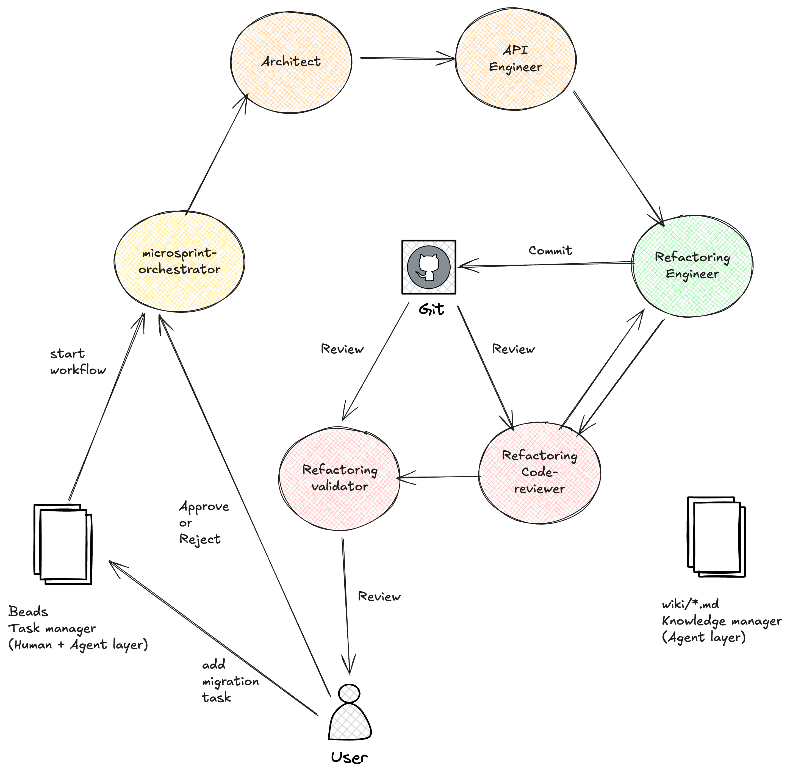

# Overview



Pied Piper is a team of AI SubAgents that can autonomously or semi-autonomously work on long-running coding tasks with full End-to-end tracking and human-in-the-loop approvals. 

These SubAgents run on Coding Agents (like Claude Code CLI), Docker, Cloud Desktop etc, so they can work even while you're AFK or sleeping or on vacation.

Pied-Piper uses the awesome [beads](https://github.com/steveyegge/beads) library by @steveyegge as Task management layer for both Agents and Humans.

View Pied-Piper Subagents in action here: https://www.youtube.com/playlist?list=PLKWJ03cHcPr3OWiSBDghzh62AErndC5pm

# Getting started

1. Install Pied-Piper
2. Create a team
3. Configure or Customize your team's workflow
4. Generate SubAgents for your Coding Agent - Claude Code CLI etc
5. Start assigning tasks to your SubAgents from Coding Agent

Links to Getting started docs
* Quickstart guides
    * Go to [QUICKSTART.md](docs/QUICKSTART.md) or [PLAYBOOK_TEST_COVERAGE.md](docs/playbook/PLAYBOOK_TEST_COVERAGE.md) to run a custom SDLC worfklow for Test coverage improvement.
* Playbooks for repeatable SDLC workflows
    * [PLAYBOOK_LANGUAGE_MIGRATION.md](docs/playbook/PLAYBOOK_LANGUAGE_MIGRATION.md) - Custom worfklow for TypeScript to Python migration
    * [PLAYBOOK_DREAM_TEAM_ENSEMBLE_MODELS.md](docs/playbook/PLAYBOOK_DREAM_TEAM_ENSEMBLE_MODELS.md) to use an ensemble of the best Coding Models for a generic Plan/Code/Review SDLC Workflow
* [Pied-Piper CLI Commands reference](https://github.com/sathish316/pied-piper?tab=readme-ov-file#pied-piper-commands)
* [Pied-Piper Concepts](docs/PIEDPIPER_SDLC_WORKFLOW_CONCEPTS.md): Overview of features like Subagents, Roles, Task workflows, Wiki workflows

# Development

Pied-piper is built using Go.

To get started with development, you can use the following commands:

1. Clone the repo

```bash
mkdir -p $GOPATH/src/github.com/
cd $GOPATH/src/github.com/sathish316
git clone https://github.com/sathish316/pied-piper.git
```

2. Run the project without building

```bash
go run main.go
```

3. Run tests

```bash
go test -v ./...
```

4. Build and Install pied-piper

4.1 Build
```bash
go build
```

4.2 Install
```bash
go install github.com/sathish316/pied-piper
```

4.3 Run Pied-Piper from anywhere
```bash
pied-piper
```

# Playbooks

Playbooks are repeatable workflows for different kinds of long-running or repeatable or complex tasks in software engineering, that can be executed by a team of Pied-Piper SubAgents:
1. Migration from library version x to version y - Rails 5 to Rails 8
2. Migration from language x to language y - Typescript to Python
4. Ensure Unit Test coverage is > 80%
5. Ensure Integration and Behavioural Test coverage is > 80%
6. Consolidate Microservices to Monolith
7. Change Tech Stack from x to y
8. Fix static code analysis violations in the codebase

Playbooks are just YML files to create a Team of SubAgents with defined roles, task workflows, wiki workflows, Agent-Agent and Human-Agent co-ordination. Find sample playbook yml files in [playbook](playbook) dir.

## Dream Team of Planner/Coder/Reviewers using an Ensemble of the best Coding Models


Create a Dream Team of SubAgents using an Ensemble of the best Coding Models:
* Planner using GPT-5.1 Codex or GPT-5.2 Codex
* Coder using Claude Opus 4.5
* Reviewers using Gemini Pro 3.0 or 2.5
* Orchestrator using Claude Haiku 4.5

Go to [PLAYBOOK_DREAM_TEAM_ENSEMBLE_MODELS.md](docs/playbook/PLAYBOOK_DREAM_TEAM_ENSEMBLE_MODELS.md) for detailed steps to use this Dream team as Claude Code SubAgents in your projects.

Claude Code Demo (Youtube):

<p align="center">
  <a href="https://youtu.be/59DaMXBbtlQ">
    
  </a>
</p>

Note: This playbook requires a Coding CLI that supports multiple Models. If you're using Claude Code, you can use [Claude-Code-Router](https://github.com/musistudio/claude-code-router) to use this playbook.

## Team of Planner/Coder/Reviewers using Claude Models



Create a Dream Team of SubAgents using the best suitable Claude Model for each role:
* Planner using Opus 4.5
* Coder using Sonnet 4.5
* Reviewers using Sonnet 4.5 or Opus 4.5
* Orchestrator using Haiku 4.5

Go to [PLAYBOOK_DREAM_TEAM_CLAUDE_MODELS.md](docs/playbook/PLAYBOOK_DREAM_TEAM_CLAUDE_MODELS.md) for detailed steps to use this Dream team as Claude Code SubAgents in your projects.

Claude Code Demo (Youtube):

<p align="center">
  <a href="https://youtu.be/q5PPrvrfaUs">
    
  </a>
</p>


## Language migration playbook


Sample Language migration playbook from Typescript to Python, using a team of Pied-Piper SubAgents.

Go to [PLAYBOOK_LANGUAGE_MIGRATION.md](docs/playbook/PLAYBOOK_LANGUAGE_MIGRATION.md) for detailed steps to run the language migration playbook using Pied-Piper.

Claude Code Demo (Youtube):

<p align="center">
  <a href="https://youtu.be/oR_TfCcjpNY">
    
  </a>
</p>


## Unit test coverage playbook


Sample Unit test coverage improvement playbook, using a team of Pied-Piper SubAgents.

Go to [PLAYBOOK_TEST_COVERAGE.md](docs/playbook/PLAYBOOK_TEST_COVERAGE.md) for detailed steps to run the unit test coverage improvement playbook using Pied-Piper.

Claude Code Demo (Youtube):

<p align="center">
  <a href="https://youtu.be/6Amq_qBzsCE">
    
  </a>
</p>


## Microservices to Monolith consolidation playbook



This is a sample Microservices to Monolith consolidation playbook, using a team of Pied-Piper SubAgents.

TODO

## Library version migration playbook

TODO

## Integration/Behavioural test coverage playbook

TODO

## Tech stack migration playbook

TODO

## Static code analysis improvements playbook

TODO

# Pied-Piper Commands

## Generate and Use SubAgents from Claude Code for SDLC Workflow

Pied-Piper generates SubAgents (*.md files) from simple specs that can be used from other Coding CLIs like Claude Code. 

SubAgents can be generated in User home directory or Project directory for each Coding Agent.

**Pied-piper CLI documentation**

#### help
```bash
$ pied-piper help
```

#### create-team
To create a default SDLC team with the name pied-piper

```bash
$ pied-piper team create --default
```

#### create-team
Create your custom team with the name pied-piper

```bash
$ pied-piper team create --name "pied-piper"
```

#### show-team
```bash
$ pied-piper team show --name "pied-piper"
```

File: **~/.pied-piper/pied-piper/config.yml**

```yml
name: "pied-piper"
subagents:
  - role: "architect"
    nickname: "Richard"
  - role: "software-engineer"
    nickname: "Gilfoyle"
  - role: "code-reviewer"
    nickname: "Dinesh"
  - role: "code-validator"
    nickname: "Erlich"
  - role: "build-engineer"
    nickname: "Jian Yang"
task_workflow:

```

#### create-subagent
If you've already updated subagents in team-config.yml, you can skip this step. Adding a subagent through CLI will update the config file.

```bash
$ pied-piper subagent create --team-name "pied-piper" --role "architect" --nickname "Richard"
```

#### show-subagent
```bash
$ pied-piper subagent show --team-name "pied-piper" --role "architect"
$ pied-piper subagent show --team-name "pied-piper" --role "architect" --nickname "Richard"
```

File: **~/.pied-piper/pied-piper/subagents/architect.yml
```yml
name: "architect"
role: "architect"
nickname: "Richard"
description: "..."
system_prompt: "..."
tools: default # configure in coding CLI
task_labels:
  incoming:
  - @ready-for-hld
  outgoing:
  - @ready-for-lld
wiki_labels:
  incoming:
  - GOAL_foo.md
  outgoing:
  - @ready-for-hld
  - @ready-for-lld
  - @plan-complete
  - @closed
```

#### customize an individual subagent

You can customize subagents either before they are generated into Coding CLI or after they are generated.

To change subagent before generation, edit **teams/<team-name>/subagents/<subagent-name>.yml** file ex: **teams/pied-piper/subagents/architect.yml** file

To change subagent after generation, directly update the Subagents in Claude or Coding CLI.

**.claude/subagents/<subagent-name>.yml** file

#### Generate SubAgents for a Coding CLI

Subagents can be generated in *.md format to target multiple Coding CLIs.

To generate all SubAgents for a team to target Claude Code:

```bash
$ pied-piper subagent generate --team-name "pied-piper" --all --target claude-code
```

#### Export SubAgents to a target Coding CLI and a target directory

Subagents can be exported in *.md format to the User directory (~/.claude) or Project directory (/path/to/project/.claude) for a target Coding CLI.

To export all SubAgents for a team to target Claude Code Project directory:

```bash
$ pied-piper subagent export all --team-name "pied-piper" --target claude-code --project-dir /path/to/project
```

To export an individual subagent to target Claude Code Project directory:

```bash
$ pied-piper subagent export subagent --team-name "pied-piper" --name "architect" --target claude-code --project-dir /path/to/project
```

#### Enrich Subagent Description

Metaprompts are used to enrich the prompt of Subagent using AI tools like Cursor or Claude Code or by directly calling LLM APIs.

In order to make sure the Subagent honors the workflow, Enrich the prompt of Subagent using AI tools like Cursor or Claude Code or LLM APIs by following the steps below:

Generate or show metaprompt (applicable to all subagents):
```bash
pied-piper subagent metaprompt
```

Go to cursor or Claude Code and use the above metaprompt to update each Subagent file Ex: **/path/to/project/.claude/agents/unittest-programmer.md**
Ensure you change the `ROLE-FILE` (using @ or # to refer to the file) and `ROLE-NAME` placeholder in metaprompt.

#### Using Pied-Piper Team's workflow from Claude Code

Go to Claude Code:
1. > Onboard to beads task management using "bd quickstart"
2. > Create a new task with the label that starts your workflow
3. > Ask microsprint-orchestrator to work on beads open tasks

For more detailed steps, refer to the playbooks:
1. [PLAYBOOK_DREAM_TEAM_ENSEMBLE_MODELS.md](docs/playbook/PLAYBOOK_DREAM_TEAM_ENSEMBLE_MODELS.md)
2. [PLAYBOOK_DREAM_TEAM_CLAUDE_MODELS.md](docs/playbook/PLAYBOOK_DREAM_TEAM_CLAUDE_MODELS.md)
3. [PLAYBOOK_TEST_COVERAGE.md](docs/playbook/PLAYBOOK_TEST_COVERAGE.md)
4. [PLAYBOOK_LANGUAGE_MIGRATION.md](docs/playbook/PLAYBOOK_LANGUAGE_MIGRATION.md)

#### Using Pied-Piper Team's workflow from other Coding CLIs

Follow the same steps as above. While generating the subagents, change --target to your Coding CLI. 

Supported Coding CLIs are:
* Claude Code

# Release

TODO: Release to homebrew

# LICENSE

This project is licensed under the O'Sassy License - see the [LICENSE.md](LICENSE.md) file and https://osaasy.dev/ for details. It's similar to the MIT license, but without the commercial rights.

