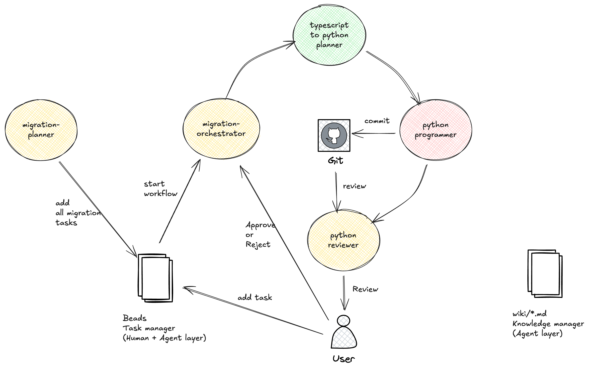

# Pied Piper - Language Migration Playbook

Migrate your codebase from TypeScript to Python with a team of AI SubAgents working in coordination.

## Custom Workflow for TypeScript to Python Migration



This playbook demonstrates a systematic approach to migrating code from TypeScript to Python:
* Roles & Responsibilities
    * migration-planner: Analyzes the TypeScript codebase and creates a migration plan with proper dependency ordering. Creates one beads task per file, ensuring dependencies are migrated first.
    * migration-orchestrator: Orchestrates the migration process one task at a time, ensuring sequential execution and proper handoffs between SubAgents.
    * typescript-to-python-planner: Deep dives into a single TypeScript file, analyzes its structure, dependencies, and creates a detailed conversion plan with Python equivalents.
    * python-programmer: Implements the Python version of the TypeScript file, writes unit tests, and ensures the code is functional and follows Python best practices.
    * python-reviewer: Reviews the migrated Python code, runs tests, checks for correctness, and either approves or rejects the implementation.
* Task management workflow
    * migration-planner
        * Incoming: #lang-migration-start
        * Outgoing: multiple tasks with label #lang-migration-ready-for-plan
    * migration-orchestrator
        * Incoming: #lang-migration-ready-for-plan
        * Outgoing: Assign task to typescript-to-python-planner
    * typescript-to-python-planner
        * Incoming: #lang-migration-ready-for-plan
        * Outgoing: #lang-migration-file-plan-complete
    * python-programmer
        * Incoming: #lang-migration-file-plan-complete, #lang-migration-file-rejected
        * Outgoing: #lang-migration-file-code-complete
    * python-reviewer
        * Incoming: #lang-migration-file-code-complete
        * Outgoing: #lang-migration-file-approved, #lang-migration-file-rejected
* Wiki workflow
    * migration-planner
        * Incoming: []
        * Outgoing: LANG_MIGRATION_PLAN.md
    * migration-orchestrator
        * Incoming: LANG_MIGRATION_PLAN.md
        * Outgoing: []
    * typescript-to-python-planner
        * Incoming: LANG_MIGRATION_PLAN.md
        * Outgoing: LANG_MIGRATION_PLAN_<TASK_ID>.md
    * python-programmer
        * Incoming: LANG_MIGRATION_PLAN_<TASK_ID>.md
        * Outgoing: []
    * python-reviewer
        * Incoming: LANG_MIGRATION_PLAN_<TASK_ID>.md
        * Outgoing: []

## Installation

```bash
go install github.com/sathish316/pied-piper
pied-piper help
```

If you're working from dev-env, you can replace "pied-piper" with "go run main.go" in below commands.

## Quick Start

### 1. Create Your Team and Add SubAgents

#FIXME: make create work to update team config.yml
```bash
pied-piper team create --name "migration-masters"

pied-piper subagent create --team "migration-masters" --role "migration-planner" --nickname "Tony"

pied-piper subagent create --team "migration-masters" --role "migration-orchestrator" --nickname "Steve"

pied-piper subagent create --team "migration-masters" --role "typescript-to-python-planner" --nickname "Bruce"

pied-piper subagent create --team "migration-masters" --role "python-programmer" --nickname "Peter"

pied-piper subagent create --team "migration-masters" --role "python-reviewer" --nickname "Natasha"
```

### 2. View Your Team members

```bash
# Show full team config
pied-piper team show --name "migration-masters"

# List all SubAgents
pied-piper subagent list --team "migration-masters"

# Show specific SubAgent
pied-piper subagent show --team "migration-masters" --name "python-programmer"
```

### 3. Edit your team's workflow

```bash
vim ~/.pied-piper/migration-masters/config.yml
``` 

Following is a trimmed down version of Pied-Piper team workflow. For full config, go to [playbook/language_migration/migration_masters_ts_to_py.md](../../playbook/language_migration/migration_masters_ts_to_py.md) and copy-paste it into your team config file.

```yml
name: "migration-masters"
subagents:
# ....
  - role: "typescript-to-python-planner"
    description: |
        Deep dives into a single TypeScript file, analyzes its structure, dependencies, and creates a detailed conversion plan with Python equivalents. This is the only role that creates file-specific wiki documentation. Each plan does not exceed 20 lines.
    nickname: "Bruce"
    task_labels:
      incoming:
      - "#lang-migration-ready-for-plan"
      outgoing:
      - "#lang-migration-file-plan-complete"
      task_workflow_description: |
        1. Typescript-to-python-planner receives beads tasks with #lang-migration-ready-for-plan label for a specific file.
        It analyzes the TypeScript file in detail:
        - Identifies all imports and dependencies
        - Maps TypeScript types to Python equivalents
        - Identifies classes, functions, interfaces, and their signatures
        - Notes any TypeScript-specific features that need special handling (decorators, generics, etc.)
        - Creates a detailed conversion plan with Python package requirements
        Once the analysis is complete, it creates a wiki file with the conversion plan and updates the task label to #lang-migration-file-plan-complete.
    wiki_labels:
      incoming:
      - "LANG_MIGRATION_PLAN.md"
      outgoing:
      - "LANG_MIGRATION_PLAN_<TASK_ID>.md"
      wiki_workflow_description: |
        Wikis are created as local markdown files in "wiki" directory.
        1. Typescript-to-python-planner receives beads tasks with #lang-migration-ready-for-plan label.
        It creates a detailed wiki file called "LANG_MIGRATION_PLAN_<TASK_ID>.md" containing:
        - Original TypeScript file structure
        - Mapping of TypeScript constructs to Python equivalents
        - Required Python packages and imports
        - Special considerations and edge cases
        - Suggested Python file structure
# ....
```

List all SubAgents to verify the team config is correct.
```bash
pied-piper subagent list --team "migration-masters"
```


### 4. Generate SubAgents for Claude Code

SubAgents are generated for a target CodingAgent in ~/.pied-piper/migration-masters/subagents directory.

**Generate all SubAgents (global):**
```bash
pied-piper subagent generate-all --team "migration-masters" --target claude-code
```

**Generate single SubAgent:**
```bash
pied-piper subagent generate --team "migration-masters" --name "python-programmer" --target claude-code
```

**Export All SubAgents to Coding CLI to a project directory:**
```bash
pied-piper export all --team "migration-masters" --target claude-code --project-dir /path/to/lang_migration_workspace
```

**Export single SubAgent to Coding CLI to a project directory:**
```bash
pied-piper export subagent --team "migration-masters" --name "python-programmer" --target claude-code --project-dir /path/to/lang_migration_workspace
```

### 5. Enrich Subagent Description using Metaprompt

Metaprompts are used to enrich the prompt of Subagent using AI tools like Cursor or Claude Code or by directly calling LLM APIs.

In order to make sure the Subagent honors the workflow, Enrich the prompt of Subagent using AI tools like Cursor or Claude Code or LLM APIs by following the steps below:

5.1 Generate or show metaprompt (applicable to all subagents):
```bash
pied-piper subagent metaprompt
```

5.2 Go to cursor or claudecode and use the above metaprompt to update each Subagent file Ex: **/path/to/project/.subagents/python-programmer.md**

### (Optional) 6. Modify Workflow and Regenerate Subagents

If you need to change the team workflow, Modify and Regenerate the Subagents

**Edit team config:**
```bash
vim ~/.pied-piper/teams/migration-masters/config.yml
```

**Regenerate SubAgent:**
```bash
pied-piper subagent generate --team "migration-masters" --name "python-programmer" --target claude-code
```

**Export single SubAgent to Coding CLI to a target directory:**
```bash
pied-piper subagent export --team "migration-masters" --name "python-programmer" --target claude-code --target-dir /path/to/lang_migration_workspace
```

### (Optional) 7. Modify SubAgent's role description from Claude Code or your editor

Once the SubAgent is generated and exported to Coding CLI, you can generate detailed workflow description and modify its behaviour using AI.

```bash
vim /path/to/project/.subagents/python-programmer.md
```

Modify the description to suit your project's needs.
```yml
----ROLE_DESCRIPTION STARTS----
This project is migrating from TypeScript to Python 3.11+.
We use type hints extensively in Python code.
We use pytest for testing with fixtures and parametrized tests.
We follow PEP 8 style guide and use black for formatting.
We use pydantic for data validation where TypeScript used interfaces.
We use dataclasses for simple data structures.
Keep the Python code idiomatic and Pythonic, not just a literal translation.
----ROLE_DESCRIPTION ENDS----
```

There is no need to regenerate the SubAgent, since you are directly editing in .subagents folder. 


### 8. Start the migration workflow

Initialize beads in project

```bash
projec-dir> beads init
```

If this is the first time you are using SubAgents and beads, run the following prompts in Claude-code:
> Run bash command "bd quickstart" to onboard to beads task management system

Create first migration task
```bash
$ bd create "migrate folder project_foo_ts from TypeScript to Python" --label "#lang-migration-start"

$ bd note "project_foo_ts is the source folder to migrate from TypeScript to Python"
```

> list beads tasks

> Ask lang-migration-planner to work on task foo

Watch the Pied-Piper team convert your whole project from TypeScript to Python, keeping you (human-reviewer) in the loop.
